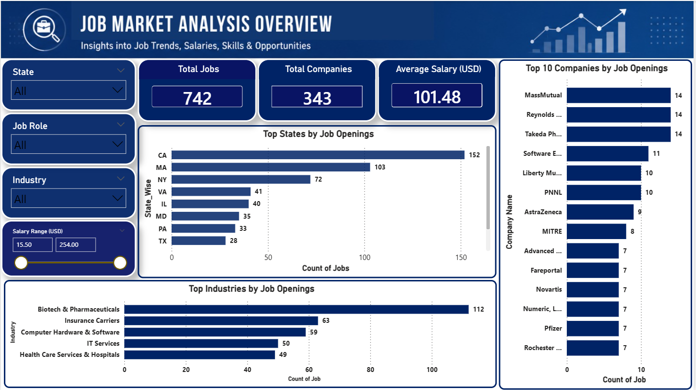
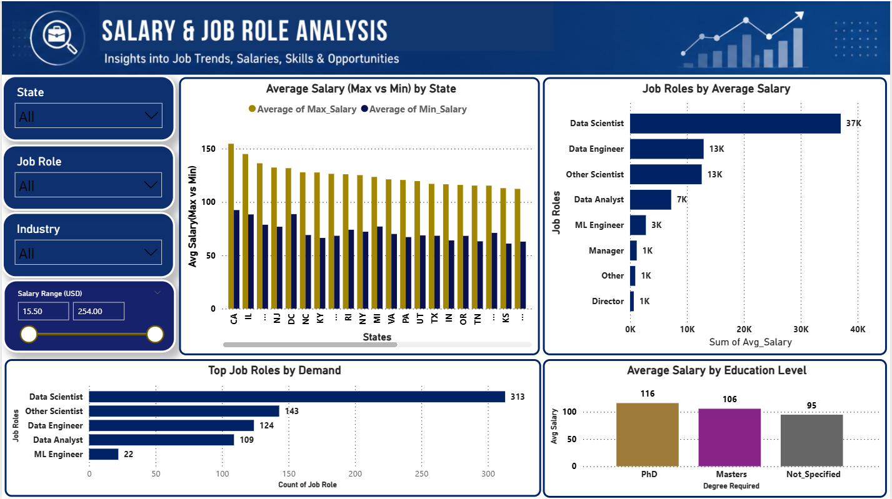
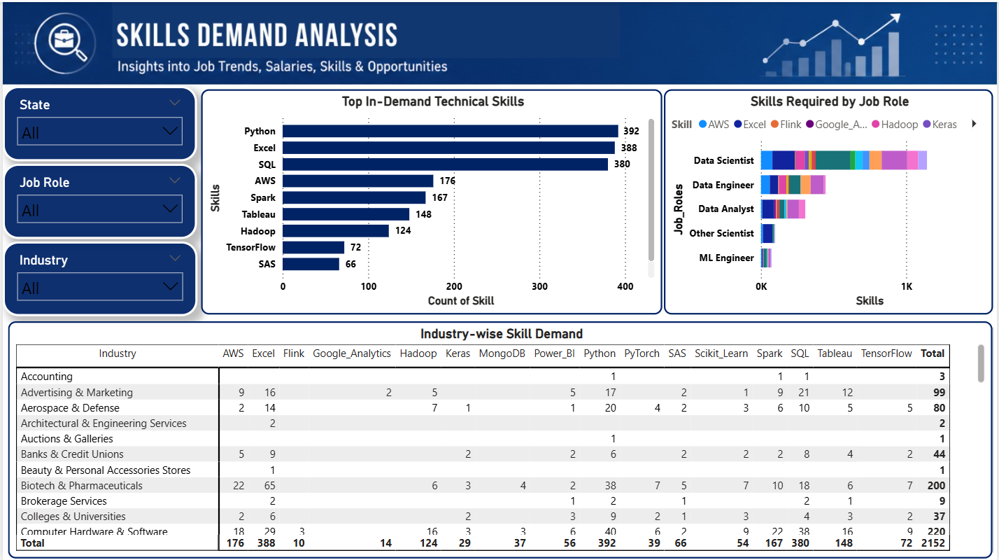

# 📊 Job Market Analysis Dashboard

# 📌 End-to-End Job Market Analysis using SQL, Python & Power BI

## 📖 Project Overview
This project focuses on analyzing job market trends using SQL, Python, and Power BI. The dashboard provides insights into hiring demand, salary distribution, industry growth, top companies, and in-demand technical skills.

The goal of this project is to help job seekers, recruiters, and businesses make data-driven decisions through interactive dashboards and business intelligence reporting.

---

# 🎯 Business Objectives

* Analyze job demand across different states
* Identify top hiring industries and companies
* Compare salary trends for different job roles
* Discover the most in-demand technical skills
* Understand the relationship between education and salary
* Build an interactive business intelligence dashboard

---

# 🛠 Tools & Technologies Used

* SQL (Data Extraction & Business Queries)
* Python (Pandas, NumPy, Data Cleaning)
* Power BI (Dashboard & Visualization)
* Power Query (Data Transformation)
* DAX (KPI Calculations)
* Jupyter Notebook

---

# 📌 Dashboard Pages

## 1️⃣ Job Market Overview Dashboard
* Total Job Listings
* Hiring Companies
* Average Salary
* Jobs by State
* Top Industries
* Top Companies

---

## 2️⃣ Salary & Job Role Analysis
* Average Salary by State
* Top Paying Job Roles
* Education vs Salary Analysis
* Job Role Demand

---

## 3️⃣ Skills Demand Analysis
* Top In-Demand Skills
* Skills Required by Job Roles
* Industry-wise Skills Demand
* Most Demanded Technical Skills

---

# 📊 Key Insights

* Python and SQL are the most demanded skills in the job market.
* Ca has the highest number of job openings.
* Data Scientist and Data Engineer roles offer higher salaries.
* Technology and Biotech industries show strong hiring demand.
* Higher education levels generally lead to better salary opportunities.

---

# 🧹 Data Processing Steps

* Data Cleaning using Python
* Handling Missing & Duplicate Values
* Feature Engineering
* Salary Transformation
* Skills Data Processing
* Data Modeling in Power BI
* Dashboard Visualization

---

# 📷 Dashboard Preview

##  Job Market Overview

---

##  Salary & Job Role Analysis

---

##  Skills Demand Analysis

---

# 📂 Project Files

* Power BI Dashboard (.pbix)
* Dashboard Screenshots (.png)
* Python Notebook (.ipynb)
* Project Report (.pdf)

---

# ✅ Conclusion

This project successfully transforms raw job posting data into an interactive business intelligence dashboard using SQL, Python, and Power BI.

The dashboard helps analyze:
* Job market demand
* Salary trends
* Hiring patterns
* Industry growth
* Technical skill requirements

This project demonstrates end-to-end data analytics workflow including data extraction, cleaning, transformation, visualization, and business insight generation.
